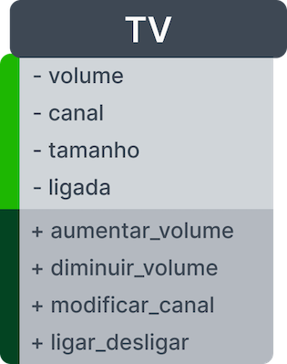
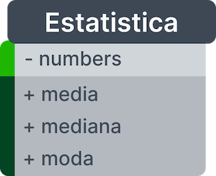
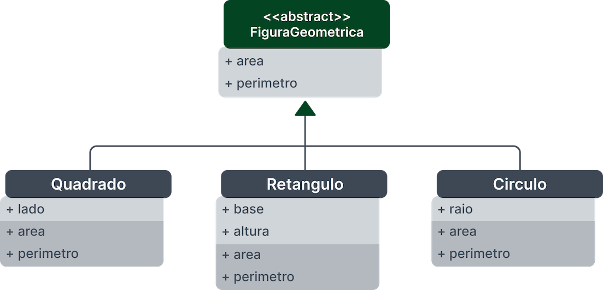

# Exercises

## Now the practice

**Exercise 01**:
Implement a class based on the diagram

Implement a class that contains the following attributes and methods.

Attributes:

- `volume` - will be initialized with a value of 50 and can only be between 0 and 99;
- `channel` - will be initialized with a value of 1 and can only be between 1 and 99;
- `size` - will be initialized with the parameter value;
- `on` - will be initialized with the value of `False`, as it is initially off.

All attributes must be private.

Methods:

- `increase_volume` - increases the volume 1 by 1 up to a maximum of 99;
- `decrease_volume` - decreases the volume by 1 to the minimum of 0;
- `modify_channel` - changes the channel according to the received parameter and should throw an exception (ValueError) if the value is out of bounds;
- `turn_off` - toggles the TV state between on and off (`True`/`False`).

**Exercise 02**:
Implement a `Statistics` class

It must have a `numbers` attribute (a list of numbers) with three methods: one that calculates the mean, one that calculates the median median, and another that calculates the mode of a list of numbers.

**Exercise 03**:
Based on the following diagram, implement the geometric figure classes.

You will need to implement the following classes:

- `FiguraGeometrica`, an abstract class with abstract methods `area` and `perimeter`.
- `Square`, which inherits from `FiguraGeometrica` and adds the `side` attribute.
- `Rectangle`, which inherits from `FiguraGeometrica` and adds `base` and `height` attributes.
- `Circle`, which inherits from `FiguraGeometrica` and adds the `radius` attribute.

