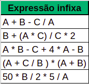

# Exercises

## Now the practice

**Exercise 01**:
Queues: create a `Queue` class, which should contain the operations: `enqueue`, `dequeue`, `peek` and `is_empty`.


**Exercise 02**:
Stacks: create a `Stack` class, which should contain the operations: `push`, `pop`, `peek` and `is_empty`.

**Exercise 03**:
Extend the `Stack` class, which we wrote during the content explanations, by adding a new function called `min_value()` that will return the smallest integer value present in the stack. For example:

*stack.py*

```
# ...

content_stack.push(1)
content_stack.push(-2)
content_stack.push(3)
print(content_stack.min_value()) # saída: -2
```

- Perform a complexity analysis of your solution.

**Exercise 04**:
Extend the `Stack` class, which we wrote during the content explanations, to support a limit of items within the stack. If we define that the stack must be size two, then it cannot have three items. For example:

*stack_limit.py*

```
# ...

content_stack = LimitStack(2)
content_stack.push(1)
content_stack.push(-2)

try:
    content_stack.push(3)
except StackOverflow:
    print("Não é possível adicionar outro item à pilha")
```

- Perform a complexity analysis of your solution.


**Exercise 05**:
A commercial parking lot has a garage in the form of a line, that is, it is only possible to stop the cars in a row. To help people who work maneuvering vehicles, we will write a program so that they can add new vehicles to the garage and remove vehicles as requested by customers. Write a program that does these two operations, inserting vehicles and removing the vehicle desired by the person. Remembering that the vehicles that were removed to reach the customer's vehicle, are parked on the street and are then added in the same order as they were in the parking lot.

- Perform a complexity analysis of your solution.


**Exercise 06**:
Given the function that resolves postfixed expressions, add subtraction and division operations. Consider the examples below to test your change in function.

Note: Transform expressions into fixed post and assign values. If necessary, `cast` the value to floating point.



- Perform a complexity analysis of your solution.


**Exercise 07**:
Given a string, containing letters and parentheses. Create a function that will reverse the characters in such a way that only the characters inside the parentheses are reversed. The final string must not contain parentheses. For example:

```
string = 'teste(lagel)'
resultado = 'testelegal'
```

- Perform a complexity analysis of your solution.