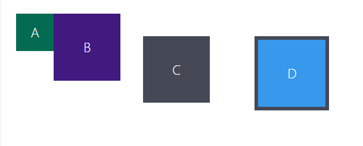

# First see the boxes layout below:



1. Now let's reproduce this item layout in your browser!

2. Copy the codes below and paste them into your VS Code, creating an index.html file and a style.css file.

3. Follow the instructions in the comments.

`index.html`
```
<!DOCTYPE html>
<html lang="pt-br">
<head>
  <meta charset="UTF-8">
  <meta name="viewport" content="width=device-width, initial-scale=1.0">
  <title>Exercício: box model</title>
  <link rel="stylesheet" href="style.css">
</head>
<body>
  <div class="caixa width-and-height" style="background: #036b52">A</div>
  <div class="caixa width-and-height padding" style="background: #41197f;">B</div>
  <div class="caixa width-and-height padding margin" style="background: #444955">C</div>
  <div class="caixa width-and-height padding margin border" style="background: #3898EC">D</div>
</body>
</html>
```

`style.css`
```
.caixa {
  color: white;
  display: inline-block;
  line-height: 50px;
  text-align: center;
  vertical-align: top;
}

.width-and-height {
  height: 50px;
  width: 50px;
}

/* insira na classe abaixo um padding de 20px para aplicá-lo aos itens B, C e D */
.padding {

}

/* insira na classe abaixo uma margem de 30px para aplicá-la aos itens C e D */
.margin {

}

/* insira na classe abaixo uma borda com valor '5px solid black' para aplicá-la ao item D */
.border {
  
}
```