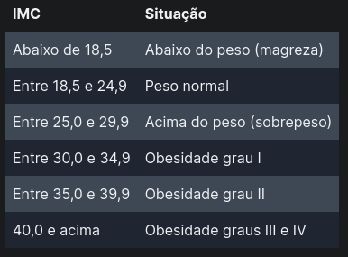

# Exercise 01

## Now the practice

1. Create code to calculate a person's body mass index (BMI).

- Store the code in the `bmi.js` file.

- The formula for calculating BMI is:

- Start by creating a new Node package with npm init and answering npm's questions.

- For now, don't bother asking for user input. Use fixed values ​​for weight and height.

2. Now, allow the code to run via the `npm run bmi` command.

- The new code created must contain the command that calls `node` to run the `bmi.js` file.

3. It's time to make our code more interactive! Let's add input inputs for anyone to use.

- Edit the code so that the `weight` and `height` values ​​are informed by the person when answering the questions: “What’s your weight?” and “What’s your height?”. You must use the `readline-sync` package.

4. Now we have a problem, the `weight` is not an integer! This means that we need to change a little the way we request input for this data.

- The `readline-sync` package has a specific function to handle these cases. Consult the [documentation](https://www.npmjs.com/package/readline-sync#utility_methods) of the package and find the proper function to input float values.

- Did you find the function? Show! Now use it to request input from `weight`.

5. Let's make our exercise a little more sophisticated. In addition to printing the BMI on the screen, also print which category in the table below that BMI fits:

- Consider the following table to classify the BMI situation:

