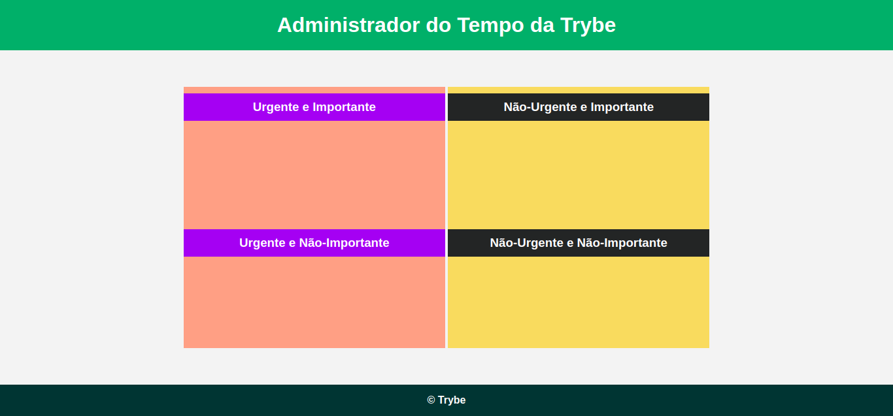

## Exercise 03

Let's consolidate the handling of the HTML elements, putting the color of the Trybe Time Manager as in the image below using only JavaScript!



You'll need to use what you've learned about `getElementBy` and `querySelector` to put it into practice.

Before starting, create an HTML file and copy the code below:

`index.html`

```
<!DOCTYPE html>
<html lang="pt-br">
  <head>
    <meta charset="UTF-8">
    <meta name="viewport" content="width=device-width, initial-scale=1.0">
    <link rel="stylesheet" href="style.css">
    <title>Administrador do Tempo</title>
  </head>
  <body id="container">
    <header id="header-container">
      <h1>Administrador do Tempo da Trybe</h1>
    </header>

    <section class="emergency-tasks">
      <div>
        <h3>Urgente e Importante</h3>
      </div>
      <div>
        <h3>Urgente e Não-Importante</h3>
      </div>
    </section>

    <section class="no-emergency-tasks">
      <div>
        <h3>Não-Urgente e Importante</h3>
      </div>
      <div>
        <h3>Não-Urgente e Não-Importante</h3>
      </div>
    </section>

    <footer id="footer-container">
      <div>&copy; Trybe</div>
    </footer>
    <script src="script.js"></script>
  </body>
</html>
```

Notice that, now, in the `script` tag, we have the `src` attribute. It will be used to import external .js files, and works similarly to importing CSS files. This way, we keep our HTML code cleaner, and we can more easily edit our JavaScript. Cool, huh?

Create a JavaScript file named “script.js” and put your knowledge of `getElementBy` and `querySelector` to work.

Also create a CSS file and copy the code below to add style to the page. Feel free to get creative and change the file as you wish!

`style.css`

```
* {
  margin: 0;
}

#container {
  font-family: Verdana, Geneva, Tahoma, sans-serif;
  text-align: center;
}

#header-container {
  color: white;
  padding: 20px;
}

.emergency-tasks {
  display: inline-block;
  height: 400px;
  margin: 56px 0;
  width: 400px;
}

.emergency-tasks div {
  height: 198px;
}
.emergency-tasks h3 {
  color: white;
  margin-top: 10px;
  padding: 10px;
}

.no-emergency-tasks {
  display: inline-block;
  height: 400px;
  width: 400px;
}

.no-emergency-tasks div {
  height: 198px;
}

.no-emergency-tasks h3 {
  color: white;
  margin-top: 10px;
  padding: 10px;
}

#footer-container {
  color: white;
  font-weight: 700;
  padding: 15px;
  text-align: center;
}
```

