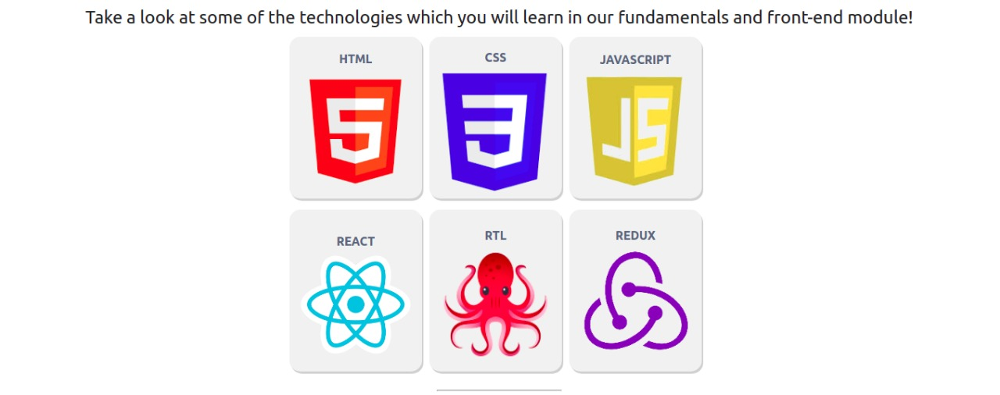

# Exercise 03

## Exercises - 🚀 Trybe Tech-Gallery

What do you think about practicing **Flexbox** concepts and testing your knowledge in a WEB application?

**Exercise A**

- Create a header for your application using the `header` tag. This header must have 3 elements and these must be positioned using Flexbox. The result should be similar to the structure of the "Trybe Tech-Gallery" page. Look at the examples below:

**Exercise B**

- Implement the contents of the first `section`. This section must contain at least one text element. Using Flexbox, do the positioning according to the example below.

**Exercise C**

- Implement the placement of the second `section`. This section must contain at least 6 images and a title for each one. Feel free to use your imagination and select the images you prefer, just don't forget to follow the proposed placement structure.

**Exercise D**

- Finally, make the positioning of the footer/footer, this is the last element necessary for our application to be complete. The footer must contain at least 2 elements. For the example, images were added that redirect the user to Trybe's social networks.

