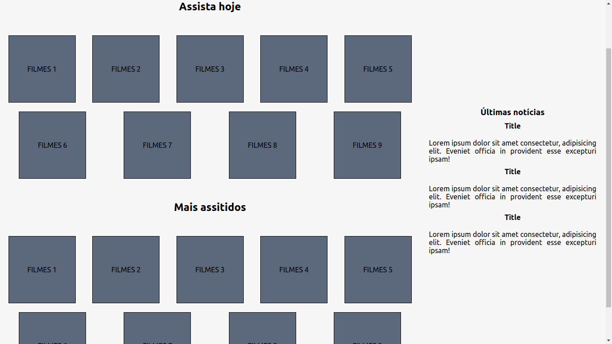

# Exercise 05

## Exercises - now the practice

For the following exercises, create an `HTML` file and a `CSS` file, copy the code below, and follow the instructions in each statement.

`index.html`

```
<!DOCTYPE html>
<html lang="pt">
  <head>
    <meta charset="UTF-8">
    <meta name="viewport" content="width=device-width, initial-scale=1.0">
    <title>TRYFLIX</title>
    <link rel="stylesheet" href="./style.css">
  </head>
  <body>
    <header class="header-container">
      <nav class="menu-container">
        <ul>
          <li>Cadastre-se</li>
          <li>Conecte-se</li>
          <li>Sobre</li>
        </ul>
      </nav>
      <section class="logo-container">
        
      </section>
    </header>

  </body>
</html>
```

`style.css`

```
* {
  margin: 0;
  padding: 0;
  box-sizing: border-box;
  font-family: 'Ubuntu';
}

body {
  background-color: rgb(247, 247, 247);
}

.header-container {
  background-color: #5C687C;
  display: flex;
}

.logo-container {
  display: flex;
  justify-content: center;
}

.menu-container {
  display: flex;
}

.menu-container ul {
  display: flex;
  justify-content: space-around;
  width: 100%;
}

.menu-container li {
  color: white;
  font-weight: 500;
  font-size: 1.3rem;
  list-style: none;
  margin-right: 10px;
}
```

- Add a property that defines the base `Flexbox` size for the `268px` image container and the `500px` menu container. After applying the properties, the `header` should look similar to the image below:


- Add a `Flexbox` property that modifies the **order** in which the logo and menu items appear on the screen. After applying the property, the `header` should look similar to the image below:


- Add a `Flexbox` property that makes the menu container grow when there is space available. After applying the property, the `header` should look similar to the image below:


- Use the `align-self` property on the correct element so that the `header` of the page has the following behavior:


- Let's continue practicing with the continuation of the `header` performed in the exercise above and build a `main` with the rest of your page. Copy the rest of the `HTML` and `CSS` code and apply it to your previously created documents.

`index.html`

```
    <main class="main-container">
      <section class="movie-container">
        <section>
          <h2>Assista hoje</h2>
          <div class="card-container">
            <div>FILMES 1</div>
            <div>FILMES 2</div>
            <div>FILMES 3</div>
            <div>FILMES 4</div>
            <div>FILMES 5</div>
            <div>FILMES 6</div>
            <div>FILMES 7</div>
            <div>FILMES 8</div>
            <div>FILMES 9</div>
          </div>
        </section>
        <article>
          <h2>Mais assitidos</h2>
          <div class="card-container">
            <div>FILMES 1</div>
            <div>FILMES 2</div>
            <div>FILMES 3</div>
            <div>FILMES 4</div>
            <div>FILMES 5</div>
            <div>FILMES 6</div>
            <div>FILMES 7</div>
            <div>FILMES 8</div>
            <div>FILMES 9</div>
          </div>
        </article>
      </section>
  <aside class="aside-container">
    <h3>Últimas notícias</h3>

    <h4>Title</h4>
    <p>Lorem ipsum dolor sit amet consectetur, adipisicing elit. Eveniet officia in provident esse excepturi ipsam!</p>

    <h4>Title</h4>
    <p>Lorem ipsum dolor sit amet consectetur, adipisicing elit. Eveniet officia in provident esse excepturi ipsam!</p>

    <h4>Title</h4>
    <p>Lorem ipsum dolor sit amet consectetur, adipisicing elit. Eveniet officia in provident esse excepturi ipsam!</p>
  </aside>
</main>
```

`style.css`

```
.main-container {
  display: flex;
  flex-wrap: wrap;
}

.movie-container {
  display: flex;
  flex-direction: column;
}

.movie-container h2 {
  margin: 40px 0;
  text-align: center;
}

.card-container {
  display: flex;
  flex-wrap: wrap;
  justify-content: space-around;
}

.card-container div {
  align-items: center;
  background-color: #5C687C;
  border: black solid 1px;
  display: flex;
  height: 150px;
  justify-content: center;
  margin: 10px;
}

.aside-container {
  display: flex;
  flex-direction: column;
  margin: 20px;
}

.aside-container h3, h4 {
  margin-bottom: 10px;
  text-align: center;
}

.aside-container p {
  margin: 10px 0;
  text-align: justify;
}
```

- Apply a `350px` base to your `aside` container. It should look similar to the image below:


- Apply one alignment to center and another to expand. Your `aside` should behave like this:


- Adicione uma propriedade que faça com que seu container de filmes tenha uma base de `700px` e outra base de `16%` para as `div` do container de seu card. Deve ficar similar à imagem abaixo:


- Apply a property with value `10` that expands the movie container. It should look similar to the image below:



- Add a property with the value `1` that makes your movie container `div` occupy all the white space. It should look similar to the image below:


